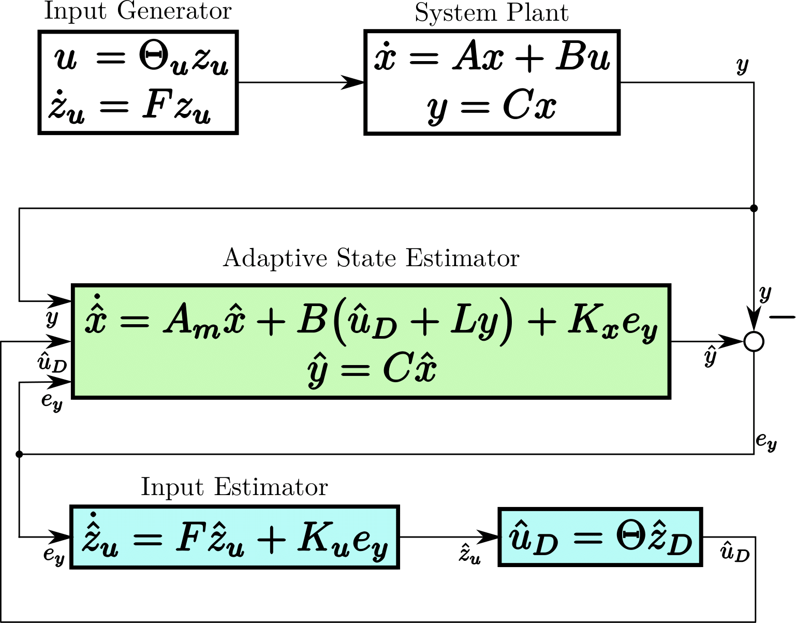
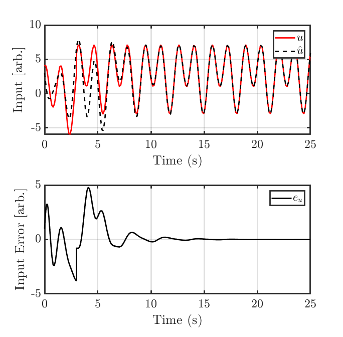

# IMECE-2021_adaptive-UIO
This repo is the implementation of our paper *System Identification Methods for Dynamic Models of Brain Activity*.
> [**An Adaptive Control Framework for Unknown Input Estimation**](https://www.sciencedirect.com/science/article/pii/S1746809421003621#!)    
> Tristan Griffith, Mark Balas       
> [International Mechanical Engineering Congress and Exposition (IMECE)](https://asmedigitalcollection.asme.org/imece)      
> https://doi.org/10.1016/j.bspc.2021.102765

## Reference
If you find this repo useful in your research, please cite our work. Gotta get those rookie numbers up.
```
@article{GRIFFITH2021102765,
title = {System identification methods for dynamic models of brain activity},
journal = {Biomedical Signal Processing and Control},
volume = {68},
pages = {102765},
year = {2021},
issn = {1746-8094},
doi = {https://doi.org/10.1016/j.bspc.2021.102765},
url = {https://www.sciencedirect.com/science/article/pii/S1746809421003621},
author = {Tristan D. Griffith and James E. Hubbard},
keywords = {System identification, Modal decomposition, EEG dynamics},}
```



==============================


## Quick Start
### 1. Clone this repository
### 2. Run Classification Model of interest


# Project Organization
------------

    ├── LICENSE
    ├── README.md          <- The top-level README for developers using this project.
    ├── reports            <- Generated analysis as HTML, PDF, LaTeX, etc.
    │   └── figures        <- Generated graphics and figures to be used in reporting
    │
    ├── src                <- Source code for use in this project.
    │   │
    │   ├── data           <- Scripts to download or generate data
    │   │  
    │   │
    │   ├── models         <- Scripts to run UIO
    │   │  
    │   │
    ├──────────────────────────────── 

--------

<p><small>Project based on the <a target="_blank" href="https://drivendata.github.io/cookiecutter-data-science/">cookiecutter data science project template</a>. #cookiecutterdatascience</small></p>
